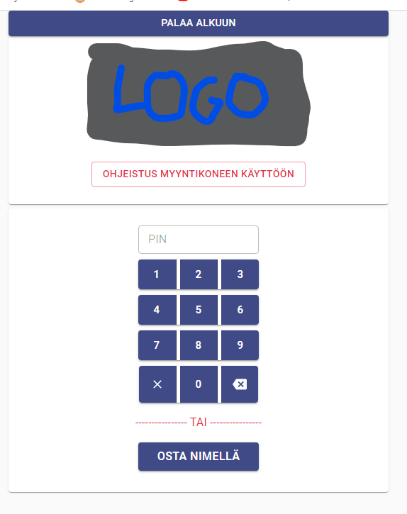
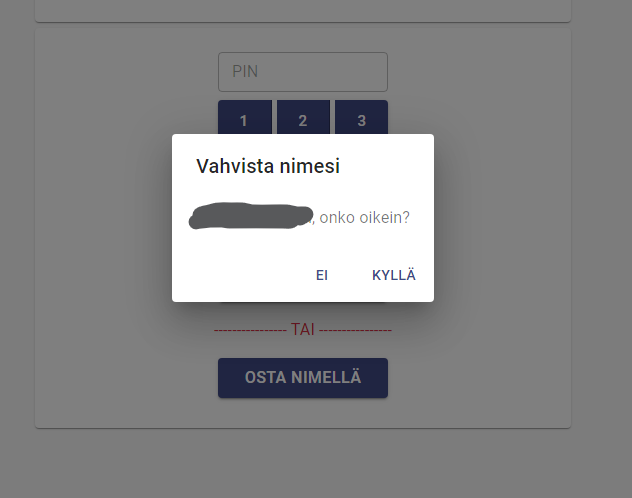
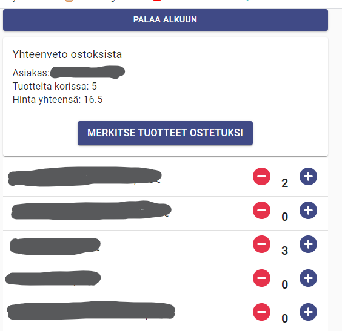
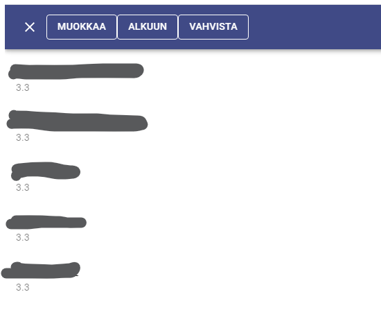

# Self-Service cashier app for small shop - FUNCTIONS = "Backend"

This is just showcase code for small app I made for some gym. They are selling some goods for their members and before this members were marking buings to paper list and company owners collected and processed this data manually and added total amount to montly member billing. This process took hours and hours worktime.

So I came up with idea for this app and after showing proof of concept to owners we just made few adjustments and polished designg and so on.

Gym has own "management" -view so they can add/modify users and goods and get selling report easily.

### Frontend

- React
- Material-Ui
- Axios
- Jwt
- Lodash
- etc

### Backend is firebase functions. Data is stored to firestore in firebase.

### Screenshots of app

#### Frontpage of app: you can "login" with your pin code or name

#### Pin checked from database and ask "is it really you?"

#### Shopping cart: select products you are buying, when ready "mark product to be bought"

#### Summary of cart and last confirmation. After this confirmation selling is saved to database and app returns to frontpage

